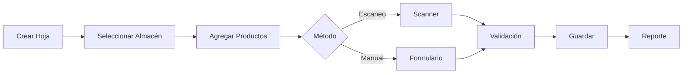

# 📦 Sistema de Gestión de Almacenes

<div align="center">
  
  
  
  [](https://react.dev/)
  [](https://vitejs.dev/)
  [](https://tailwindcss.com/)
  [](https://tanstack.com/query/latest)
  [](LICENSE)

  **Sistema completo de gestión y control de inventarios para almacenes con escaneo de códigos de barras**

  [Características](#-características-principales) • [Tecnologías](#-tecnologías-utilizadas) • [Instalación](#-instalación) • [Uso](#-uso) • [Arquitectura](#-arquitectura-del-proyecto)

</div>

---

## 📋 Tabla de Contenidos

- [Sobre el Proyecto](#-sobre-el-proyecto)
- [Características Principales](#-características-principales)
- [Tecnologías Utilizadas](#-tecnologías-utilizadas)
- [Requisitos Previos](#-requisitos-previos)
- [Instalación](#-instalación)
- [Configuración](#-configuración)
- [Uso](#-uso)
- [Arquitectura del Proyecto](#-arquitectura-del-proyecto)
- [Scripts Disponibles](#-scripts-disponibles)
- [Estructura de Carpetas](#-estructura-de-carpetas)
- [Funcionalidades Detalladas](#-funcionalidades-detalladas)
- [Roadmap](#-roadmap)
- [Contribución](#-contribución)
- [Licencia](#-licencia)

---

## 🚀 Sobre el Proyecto

El **Sistema de Gestión de Almacenes** es una aplicación web moderna diseñada para optimizar el control de inventarios en almacenes y centros de distribución. Desarrollada con React y las últimas tecnologías frontend, proporciona una interfaz intuitiva y eficiente para la gestión completa de productos, almacenes, hojas de inventario y reportes.

### 🎯 Objetivos

- **Eficiencia**: Reducir el tiempo de gestión de inventarios mediante escaneo de códigos de barras
- **Control**: Proporcionar visibilidad completa del stock en tiempo real
- **Escalabilidad**: Arquitectura preparada para crecer con las necesidades del negocio
- **Usabilidad**: Interfaz intuitiva y responsive para cualquier dispositivo

---

## ✨ Características Principales

### 📊 Gestión de Almacenes
- ✅ Crear, editar y eliminar almacenes
- ✅ Asignar propietarios (entidades) a cada almacén
- ✅ Control de estado (activo/inactivo)
- ✅ Búsqueda y paginación de resultados
- ✅ Series automáticas para identificación única

### 📦 Gestión de Productos
- ✅ CRUD completo de productos
- ✅ Códigos de barras únicos (EAN-13, UPC, Code128, etc.)
- ✅ Información detallada: nombre, descripción, unidad, precio
- ✅ Búsqueda avanzada y filtros
- ✅ Exportación a Excel

### 📝 Hojas de Inventario
- ✅ Creación de hojas de inventario por almacén
- ✅ Múltiples estados: pendiente, registrado, aprobado
- ✅ Agregar productos mediante:
  - 📷 **Escaneo individual** con cámara
  - 📷 **Escaneo masivo** de múltiples códigos
  - ⌨️ Entrada manual
- ✅ Cálculos automáticos de totales
- ✅ Edición y eliminación con control de permisos

### 📱 Escaneo de Códigos de Barras
- ✅ Tecnología **@zxing/library** para máxima compatibilidad
- ✅ Soporte para formatos estándar:
  - EAN-13, EAN-8 (códigos de productos comerciales)
  - UPC-A, UPC-E
  - Code 128, Code 39, ITF
  - Códigos QR
- ✅ Escaneo en tiempo real con feedback visual
- ✅ Modo individual y masivo
- ✅ Auto-detección sin necesidad de capturar

### 👥 Gestión de Usuarios y Cuentas
- ✅ Sistema multi-tenant (multi-empresa)
- ✅ Roles: Admin, User
- ✅ Asignación de almacenes por usuario
- ✅ Relación con entidades responsables
- ✅ Control de acceso basado en roles (RBAC)

### 📈 Reportes e Informes
- ✅ Reporte de hojas de inventario por almacén
- ✅ Filtros por fechas y estado
- ✅ Exportación a Excel con formato profesional
- ✅ Resúmenes y totales automáticos

### 🎨 Interfaz de Usuario
- ✅ Diseño moderno con **shadcn/ui**
- ✅ Completamente responsive (móvil, tablet, desktop)
- ✅ Tema consistente con TailwindCSS
- ✅ Notificaciones toast para feedback inmediato
- ✅ Indicadores de carga y estados
- ✅ Modales y diálogos de confirmación

---

## 🛠 Tecnologías Utilizadas

### Frontend Core
- **[React 19.1.0](https://react.dev/)** - Librería de UI con las últimas características
- **[Vite 6.3.5](https://vitejs.dev/)** - Build tool ultra-rápido
- **[React Router 7.6.1](https://reactrouter.com/)** - Enrutamiento declarativo

### Estado y Datos
- **[React Query 5.90.3](https://tanstack.com/query/latest)** - Gestión de estado del servidor
- **[Zustand 5.0.8](https://zustand-demo.pmnd.rs/)** - Estado global ligero
- **[Axios 1.12.2](https://axios-http.com/)** - Cliente HTTP

### Formularios
- **[React Hook Form 7.56.3](https://react-hook-form.com/)** - Formularios performantes
- **[Zod 3.24.4](https://zod.dev/)** - Validación de esquemas

### UI/UX
- **[Tailwind CSS 4.1.7](https://tailwindcss.com/)** - Estilos utility-first
- **[shadcn/ui](https://ui.shadcn.com/)** - Componentes accesibles y personalizables
- **[Radix UI](https://www.radix-ui.com/)** - Primitivos de UI accesibles
- **[Lucide React](https://lucide.dev/)** - Iconos modernos
- **[Framer Motion 12.15.0](https://www.framer.com/motion/)** - Animaciones fluidas

### Funcionalidades Especiales
- **[@zxing/library 0.21.3](https://github.com/zxing-js/library)** - Escaneo de códigos de barras
- **[xlsx 0.18.5](https://sheetjs.com/)** - Exportación a Excel
- **[date-fns 4.1.0](https://date-fns.org/)** - Manipulación de fechas
- **[React Toastify 11.0.5](https://fkhadra.github.io/react-toastify/)** - Notificaciones

---

## 📋 Requisitos Previos

Antes de comenzar, asegúrate de tener instalado:

- **Node.js** >= 18.0.0
- **pnpm** >= 10.4.1 (gestor de paquetes recomendado)
- **Git** para clonar el repositorio
- **Cámara** (opcional, para escaneo de códigos)

---

## 💻 Instalación

### 1. Clonar el repositorio

```bash
git clone https://github.com/Pedrosandoval2/mini_sivesoft_frontend.git
cd warehouse-management
```

### 2. Instalar dependencias

```bash
pnpm install
```

> **Nota**: Si prefieres usar npm o yarn:
> ```bash
> npm install
> # o
> yarn install
> ```

### 3. Configurar variables de entorno

Crea un archivo `.env` en la raíz del proyecto:

```env
VITE_API_URL=http://localhost:3000/api
VITE_APP_NAME=Sistema de Gestión de Almacenes
```

---

## ⚙️ Configuración

### Backend API

Este frontend requiere un backend compatible. Asegúrate de que tu API tenga los siguientes endpoints:

```
Auth:
POST   /auth/login
POST   /auth/logout

Warehouses:
GET    /warehouses
POST   /warehouses
GET    /warehouses/:id
PATCH  /warehouses/:id
DELETE /warehouses/:id
GET    /warehouses/by-user

Products:
GET    /products
POST   /products
GET    /products/:id
PATCH  /products/:id
DELETE /products/:id
GET    /products/barcode/:barcode

Inventory Sheets:
GET    /inventory-sheets
POST   /inventory-sheets
GET    /inventory-sheets/:id
PATCH  /inventory-sheets/:id
DELETE /inventory-sheets/:id

Entities:
GET    /entities
POST   /entities
PATCH  /entities/:id
DELETE /entities/:id

Users/Accounts:
GET    /users
POST   /users
PATCH  /users/:id
DELETE /users/:id
```

---

## 🎯 Uso

### Desarrollo

Inicia el servidor de desarrollo:

```bash
pnpm dev
```

La aplicación estará disponible en `http://localhost:5173`

### Build de Producción

```bash
pnpm build
```

Los archivos optimizados se generarán en la carpeta `dist/`

### Preview de Producción

```bash
pnpm preview
```

### Linting

```bash
pnpm lint
```

---

## 🏗 Arquitectura del Proyecto

### Patrón de Diseño

El proyecto sigue una arquitectura basada en **componentes funcionales** con **hooks** y **separación de responsabilidades**:

```
┌─────────────────┐
│   Componentes   │ ← Presentación (UI)
└────────┬────────┘
         │
┌────────▼────────┐
│     Hooks       │ ← Lógica de negocio
└────────┬────────┘
         │
┌────────▼────────┐
│    Services     │ ← Comunicación API
└────────┬────────┘
         │
┌────────▼────────┐
│      API        │ ← Backend
└─────────────────┘
```

### Estado Global

- **Zustand**: Estado de autenticación (usuario, token, tenant)
- **React Query**: Cache de datos del servidor
- **React Hook Form**: Estado local de formularios

### Flujo de Datos

```
Componente → Hook → Service → API
                ↓
         React Query Cache
                ↓
         Componente (re-render)
```

---

## 📁 Estructura de Carpetas

```
warehouse-management/
├── public/                 # Archivos estáticos
│   ├── favicon.ico
│   └── image1.webp        # Imagen principal
│
├── src/
│   ├── api/               # Configuración de Axios
│   │   └── axios.config.js
│   │
│   ├── components/        # Componentes reutilizables
│   │   ├── Layout.jsx            # Layout principal
│   │   ├── ProtectedRoute.jsx    # HOC para rutas protegidas
│   │   ├── codesModal/           # Modal de escaneo masivo
│   │   ├── scannerBarCode/       # Modal de escaneo individual
│   │   └── ui/                   # Componentes shadcn/ui
│   │
│   ├── hooks/             # Custom hooks
│   │   ├── mutations/            # Hooks de React Query mutations
│   │   ├── queries/              # Hooks de React Query queries
│   │   ├── useDebounce.js
│   │   └── use-mobile.js
│   │
│   ├── lib/               # Utilidades y configuraciones
│   │   ├── react-query.js        # Configuración de React Query
│   │   └── utils.js              # Funciones helper (cn)
│   │
│   ├── pages/             # Páginas/vistas de la aplicación
│   │   ├── accounts/             # Gestión de cuentas
│   │   ├── companySelect/        # Selección de empresa
│   │   ├── entities/             # Gestión de entidades
│   │   ├── home/                 # Página principal
│   │   ├── inventory/            # Hojas de inventario
│   │   ├── login/                # Autenticación
│   │   ├── products/             # Gestión de productos
│   │   ├── reports/              # Reportes
│   │   └── warehouse/            # Gestión de almacenes
│   │
│   ├── routes/            # Configuración de rutas
│   │   └── routesPages.jsx
│   │
│   ├── services/          # Servicios de API
│   │   ├── auth/
│   │   ├── entities/
│   │   ├── products/
│   │   └── warehouse/
│   │
│   ├── store/             # Estado global (Zustand)
│   │   └── userStore.js
│   │
│   ├── utils/             # Funciones auxiliares
│   │   ├── formatDate.js
│   │   ├── formatNumberWithZero.js
│   │   └── IsUser.js
│   │
│   ├── App.jsx            # Componente raíz
│   ├── App.css
│   ├── main.jsx           # Punto de entrada
│   └── index.css
│
├── .eslintrc.js           # Configuración ESLint
├── vite.config.js         # Configuración Vite
├── tailwind.config.js     # Configuración Tailwind
├── package.json
├── pnpm-lock.yaml
└── README.md
```

---

## 🎨 Funcionalidades Detalladas

### 1. Escaneo de Códigos de Barras

#### Tecnología: @zxing/library

El sistema utiliza **ZXing** (Zebra Crossing), la misma tecnología de Google, para escaneo de códigos:

**Características:**
- ✅ Escaneo en tiempo real (30-60 fps)
- ✅ Auto-detección sin captura manual
- ✅ Soporte multi-formato
- ✅ Feedback visual con área de enfoque
- ✅ Manejo inteligente de errores

**Modos de Escaneo:**

##### 🔍 Modo Individual
```jsx
<QrScannerModal
  isOpen={qrScannerOpen}
  onScanSuccess={(barcode) => addProductByBarcode(barcode)}
  onClose={() => setQrScannerOpen(false)}
/>
```

##### 📦 Modo Masivo
```jsx
<CodesModal
  isOpen={codesModalOpen}
  onAddCodes={(codes) => addMultipleProducts(codes)}
  onClose={() => setCodesModalOpen(false)}
/>
```

### 2. Gestión de Inventarios

#### Flujo Completo



#### Estados de Hoja

- **Pendiente**: Recién creada, en proceso
- **Registrado**: Completa pero sin aprobar
- **Aprobado**: Validada y cerrada

### 3. Sistema Multi-Tenant

Cada usuario pertenece a una empresa (tenant) y solo puede ver/gestionar datos de su empresa:

```javascript
// Filtrado automático por tenant
const warehouses = useWarehousesByUser() // Solo almacenes del tenant actual
```

### 4. Control de Acceso (RBAC)

```javascript
// Ejemplo de protección por rol
{!isUser(role) && (
  <Button onClick={handleCreate}>
    Crear Almacén
  </Button>
)}
```

**Roles:**
- **Admin**: Acceso completo (crear, editar, eliminar)
- **User**: Solo lectura y reportes

---

## 📊 Scripts Disponibles

| Script | Descripción |
|--------|-------------|
| `pnpm dev` | Inicia servidor de desarrollo en http://localhost:5173 |
| `pnpm build` | Genera build optimizado para producción |
| `pnpm preview` | Preview del build de producción |
| `pnpm lint` | Ejecuta ESLint para encontrar problemas |

---

## 🗺 Roadmap

### Versión Actual (v1.0)
- ✅ CRUD de almacenes, productos, entidades
- ✅ Hojas de inventario con escaneo
- ✅ Reportes básicos
- ✅ Sistema multi-tenant
- ✅ Control de acceso por roles


## 🤝 Contribución

Las contribuciones son bienvenidas. Por favor, sigue estos pasos:

1. **Fork** el proyecto
2. Crea una **rama** para tu feature (`git checkout -b feature/AmazingFeature`)
3. **Commit** tus cambios (`git commit -m 'Add: nueva característica'`)
4. **Push** a la rama (`git push origin feature/AmazingFeature`)
5. Abre un **Pull Request**

### Convenciones de Commits

Seguimos [Conventional Commits](https://www.conventionalcommits.org/):

- `feat:` Nueva característica
- `fix:` Corrección de bug
- `docs:` Cambios en documentación
- `style:` Formateo, estilos
- `refactor:` Refactorización de código
- `test:` Tests
- `chore:` Tareas de mantenimiento

---

## 📄 Licencia

Este proyecto está bajo la Licencia MIT. Ver el archivo [LICENSE](LICENSE) para más detalles.

---

## 👨‍💻 Autor

**Pedro Sandoval**

- GitHub: [@Pedrosandoval2](https://github.com/Pedrosandoval2)
- LinkedIn: [Pedro Sandoval](https://www.linkedin.com/in/pedro-sandoval)

---

## 🙏 Agradecimientos

- [shadcn/ui](https://ui.shadcn.com/) por los componentes base
- [Radix UI](https://www.radix-ui.com/) por los primitivos accesibles
- [ZXing](https://github.com/zxing-js/library) por la librería de escaneo
- [React Query](https://tanstack.com/query/latest) por el manejo de estado del servidor

---

<div align="center">

**⭐ Si este proyecto te fue útil, considera darle una estrella ⭐**

**Hecho con ❤️ y ☕ por [Pedro Sandoval](https://github.com/Pedrosandoval2)**

</div>
